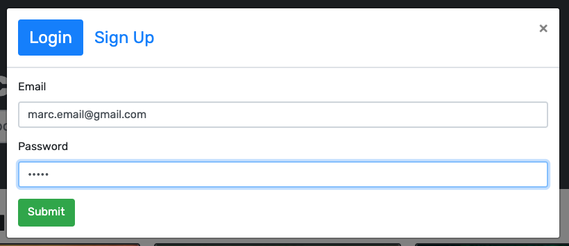
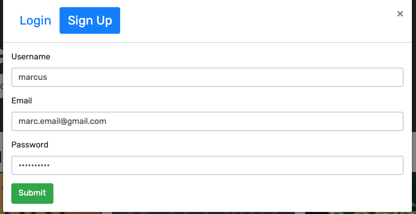

# Book-Search-Engine

---

## Table of Contents

1.  [Description](#Description)
2.  [Installation](#Installation)
3.  [Usage](#Usage)
4.  [License](#License)
5.  [Contributing](#Contributing)
6.  [Questions](#Questions)

 

## Description

The main goal for this project was to refactor they existing RESTful API code for the search engine with GraphGL and Apollo Server. This is done using the MERN stack which include a react front-end, MongoDB database and Node.js/Expresss.js server and API.

The four main steps were:

1. Set up an Apollo Server to use GraphQL queries and mutations to fetch and modify data, replacing the existing RESTful API.

2. Modify the existing authentication middleware so that it works in the context of a GraphQL API.

3. Create an Apollo Provider so that requests can communicate with an Apollo Server.

4. Deploy your application to Heroku with a MongoDB database using MongoDB Atlas.

My two challenges that I am yet to resolve are connecting mongo DB Atlas to heroku and my login/sign up data.

 

## Installation

Firstly, you must clone the code to your machine.
Once the the code has been cloned, in the root folder open the command line and enter `npm install` This will install all dependencies that are required for the application to launch.

Once this has complete, enter `npm run build` this will allow the application to build and finally enter `npm run develop` this will allow both the front end and back end server to run concurrently.

  

## Usage

Unfortunately, I had trouble connecting mongoDB Atlas and therefor my app is failing to load in heroku.
Please clone the repository and run `npm run develop` to view the app at localhost:3000

 

## License

This application has the following license:
[MIT License](https://opensource.org/licenses/MIT)

 

## Contributing

Please email me to discuss further.

 

## Questions

_If you would like to know more or have a question you'd like to ask, please contact me via email marc.malliate@gmail.com or you may also like to checkout my work [here](https://github.com/marcmalliate)_

 

### You may also like to view the GitHub repository which contains the code repository:

https://github.com/marcmalliate/Book-Search-Engine

 

### Screenshot of application:

Wen you search for a book:

When you save a book:

Login:

Sign up:

 

To view and test the deployed app visit (not loading yet) : https://book-search-engine-1.herokuapp.com/

 

© _2021 Marc Malliate - Professional Readme Generator_
